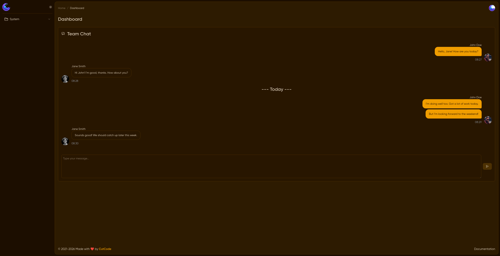

## About

Lunar Chat is a chat UI component for MoonShine 4 that allows you to display chat messages, handle multiple content blocks, and integrate real-time updates via WebSockets.


```
[
    'id' => 1, // ID for  message
    'author_id' => rand(1, 9999), // ID the author
    'sent' => true, // Boolean indicating whether the message was sent by the current user (true) or received (false)
    'author' => 'John Doe', // The display name of the author of the message
    'time' => now()->format('H:i'), // Timestamp of the message in "hours:minutes" format
    'blocks' => [
        ['type' => 'paragraph', 'contents' => ['Hello, how are you today?']],
        // Each block represents a part of the message.
        // 'type' can be 'paragraph', 'image', etc.
        // 'contents' is an array of strings that make up the block.
    ],
    'avatar' => 'https://i.pravatar.cc/150?img=11', // URL for the author's avatar image
]

```



## Features

- Multiple content blocks per message (paragraphs)
- Customizable title and placeholder
- WebSocket support for real-time chat
- Private/public chat mode
- Fully type-safe with `ChatMessageCollection` and `ChatMessageObject`

## Install

```shell
composer require nexttech/moonshine-lunar-chat
```
### Publish assets (JS & CSS):

```shell
php artisan vendor:publish --tag=moonshine-lunar-chat-assets
```

## Usage

```php
use NextTech\MoonShineLunarChat\Components\LunarChat;
use NextTech\MoonShineLunarChat\Collections\ChatMessageCollection;

// Create a ChatMessageCollection first
$messages = ChatMessageCollection::fromArray($data);

// Configure the chat component
LunarChat::make(title: 'Team Chat', placeholder: 'Type your message...')
    ->messages($messages)                     // Pass the collection of messages (ChatMessageCollection)
    ->websocket('chat-channel', 'NewMessageEvent') // Connect a WebSocket: channel and event for real-time messages
    ->private()                               // Make the chat private (for single user or restricted group)
    ->action('sendMessage')                   // Set the action name for sending messages through the form
    ->user(auth()->id());                     // Set the current user's ID
```

```php
use NextTech\MoonShineLunarChat\Components\LunarChat;
use NextTech\MoonShineLunarChat\Collections\ChatMessageCollection;

protected function components(): iterable
{
    $messages = ChatMessageCollection::fromArray([
        [
            'id' => 1,
            'author_id' => 123,
            'sent' => true,
            'author' => 'John Doe',
            'time' => now()->format('H:i'),
            'blocks' => [
                ['type' => 'paragraph', 'contents' => ['Hello, how are you today?']],
            ],
            'avatar' => 'https://i.pravatar.cc/150?img=11',
        ],
        [
            'id' => 2,
            'author_id' => 456,
            'sent' => false,
            'author' => 'Jane Smith',
            'time' => now()->addMinute()->format('H:i'),
            'blocks' => [
                ['type' => 'paragraph', 'contents' => ['Hi John! I\'m good, thanks.']],
            ],
            'avatar' => 'https://i.pravatar.cc/150?img=12',
        ],
    ]);

    return [
        LunarChat::make(title: 'Team Chat', placeholder: 'Type your message...')
            ->messages($messages)
            ->websocket('chat-channel', 'NewMessageEvent'),
    ];
}

```

### Example with multiple blocks

```php
[
    'sent' => true,
    'author' => 'John Doe',
    'time' => now()->format('H:i'),
    'blocks' => [
        [
            'type' => 'paragraph',
            'contents' => ['I\'m doing well.'],
        ],
        [
            'type' => 'paragraph',
            'contents' => ['Today is very busy.'],
        ],
    ],
]
```

## Creating a Single Message

You can create a single chat message using the `ChatMessageObject` and add it to a `ChatMessageCollection`. 
This is useful if you want to dynamically append messages instead of passing an array all at once.

```php
use NextTech\MoonShineLunarChat\Collections\ChatMessageCollection;
use NextTech\MoonShineLunarChat\DataTransferObject\ChatMessageObject;
use NextTech\MoonShineLunarChat\DataTransferObject\ChatBlockObject;

$message = new ChatMessageObject(
    'id' => 2,
    'author_id' => 456,
    'sent' => false,
    'author' => 'Jane Smith',
    'time' => now()->addMinute()->format('H:i'),
    blocks: [
        new ChatBlockObject('paragraph', ['Hello, how are you today?'])
    ],
    avatar: 'https://i.pravatar.cc/150?img=11'
);

// Create a collection and add the message
$collection = new ChatMessageCollection();
$collection->addMessage($message);
```
## Example: Label / Divider message

If you want to add a label or system message, you can create a message with a `label` block:

```php
$labelMessage = [
    'label' => '--- Lunar Chat ---'
];

$collection->addMessage($labelMessage);
```

### Notes
- `blocks` can contain multiple paragraphs, images, or other content types.
- `Label messages` are rendered differently in the chat UI but are still valid ChatMessageObject.
-  Using `addMessage()` ensures type safety and allows IDE autocomplete for message properties.

## WebSocket Integration

Lunar Chat supports real-time updates via WebSockets, using Laravel Echo (Pusher or compatible driver). This allows your chat to automatically update when new messages arrive.

### Requirements
- Laravel Echo must be available in the frontend (`window.Echo`)
- A WebSocket backend (Pusher, Soketi, Laravel Reverb, etc.)
- Events in Laravel broadcasting new messages

### Initialize Lunar Chat with WebSocket

```php
use NextTech\MoonShineLunarChat\Collections\ChatMessageCollection;
use NextTech\MoonShineLunarChat\Components\LunarChat;

$messages = ChatMessageCollection::fromArray($data);

LunarChat::make(title: 'Team Chat', placeholder: 'Type your message...')
    ->messages($messages)
    ->websocket('chat-channel', 'NewMessageEvent'); // <- channel and event
```
### What happens on the frontend

The component expects `window.Echo` to be initialized and available. It uses the channel and event you provide to listen for incoming messages.

Example JavaScript (already included via `lunar-chat.js`):

```javascript
subscribe() {
    try {
        const channelName = this.isPrivate
            ? `private-${this.websocket.channel}`
            : this.websocket.channel;

        this.echoInstance = this.isPrivate
            ? window.Echo.private(channelName)
            : window.Echo.channel(channelName);

        this.echoInstance.listen(`.${this.websocket.listen}`, (message) => {
            if (message.sent && message.author_id === this.userId) {
                return;
            }

            this.handleIncomingMessage(message);
        });
    } catch (error) {
        console.error('Subscribe error:', error);

        this.showToast('Failed to subscribe to channel', 'error');
    }
}
```
### Notes
- The event payload must contain the same structure (`id`, `authorId`, `sent`, `author`, `time`, `blocks`, `avatar`) as in your PHP array.
